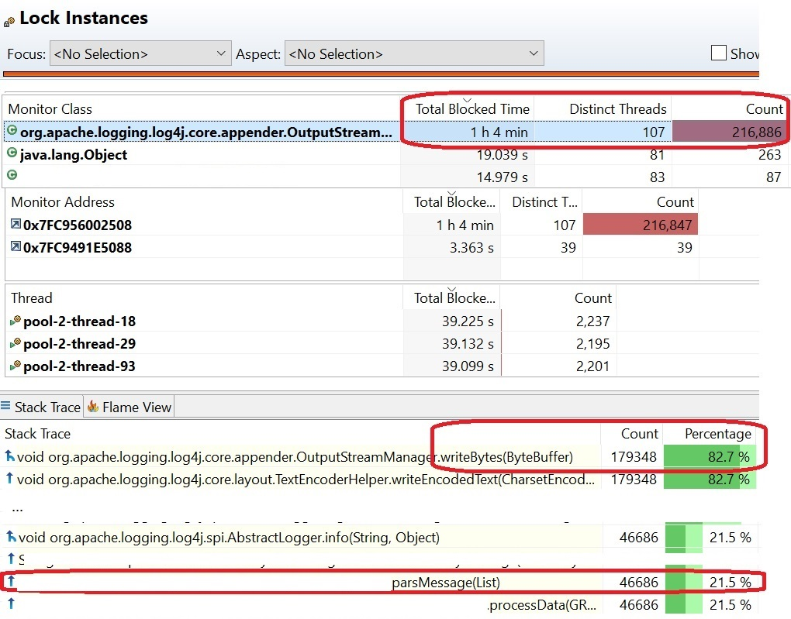

---
title: "Logging impact application performance"  
date: "2022-01-09"  
publishdate: "2022-01-09"  
authors: "Liran Mendelovich"  
img: "docs/liran.jpg"  
draft: true  
tags: ["performance", "scale", "multi-threading", "java"]  
layout: "section"  
---

# logging impact on application performance

## Highlights

* non-compliant and excessive logging
* Real high scale execution recording showing the effect
* -> Why valid log writing is very important

## Story

Consider the following code:

```
parseMessage(List<Message> messages) {
	log.debug("messages: " + messages);
}
```

or on a different version:

```
parseMessage(List<Message> messages) {
	log.debug("messages: {}", messages.toString());
}
```

What is the issue with this code line of log writing ?

This resulting with toString() method invocation on each call, even when log verbosity resulting with nothing written in log. This method invocation is redundant, and when written in such processing methods which are executed per message, can result in performance degradation in high scale executions.  
Similar effect could arise if this was intended for logging in info verbosity such that it was printed to log.

## Real high scale execution recording showing the effect

During high scale test analysis, resources were analyzed. Execution was with 100 parallel threads processing the data.  
With things like memory heap dump and thread dump, such described phenomena do not comes to place, since it results
in temporary high resources usage of memory allocation, CPU processing, and possibly file IO if this is written to log
according to verbosity. As these are temporary, it is not reflects in the memory heap dump and others.
This is where process recording analysis comes to place.

Look on memory, before logging changes:

Here we see 70G of temporary memory consumption is used from the non-compliant logging.  
This can cause garbage collector redundant heavy processing, which uses system memory and CPU.
---
Look on memory, after logging changes:

-> 70G of temporary memory consumption is removed.
---
Look on method profiling, before logging changes:

Here we see many of the methods invocations are redundant.
---
Look on method profiling, after logging changes:

-> Redundant methods invocations are removed.
---
Look on lock instances, before logging changes:

Here we see long processing time is spent busy with logging, which can be changed to debug.

### Execution improvements after logging changes
after fixing non-compliant logging, and moving some excessive logging to debug, execution showed massive improvement.
Reduced at least temporary **70G memory** consumption per the recording from the non-compliant logging.
**Processing time down from 1~ minute to 25 seconds** after fixing non-compliant logging, and moving some excessive logging to debug.

## Solution

### Non-compliant logging
Solution is valid code writing which will cause toString() method invocation only when needed, for example when log is in debug verbosity: 

```
parseMessage(List<Message> messages) {
	log.debug("messages: {}", messages);
}
```

### Excessive logging
Review logging, move non-necessary log to DEBUG or remove if not needed anymore post development.

## Conclusion

Fixing non-compliant logging, and reducing excessive logging can drastically improve performance, reduce processing time,
reduce CPU and temporary memory usage and I/O for log file writing.


